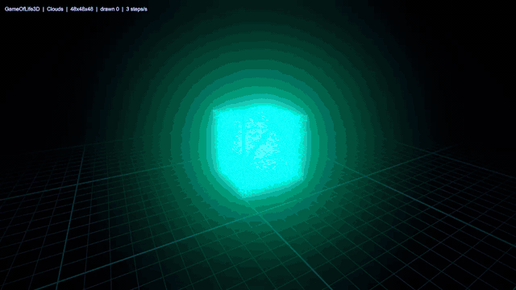

# GameOfLife3D

A volumetric Game of Life for Unity 6 + URP. The cellular automaton runs
entirely in a compute shader and renders as a floating cloud of glowing
instanced cubes you can orbit, paint into, and — eventually — reach into with
your hands in passthrough AR.

Built AR-first for OpenXR, but everything works on the desktop today.


*The default `Pyroclastic` rule: ~7% of cells alive, fading refractory trails
behind the living fronts, bloom doing the glow. The floor grid is a parallax
reference so orbiting reads as movement.*

```
Assets/GameOfLife3D/          ← all project code lives here
├── Scripts/                  ← one self-wiring component per concern
├── Resources/                ← compute + shaders, loaded by name
└── Validation~/              ← headless Python mirror of the step rule
```

## More of it running

| | |
|---|---|
|  | **Gosper glider gun.** `Conway2D` in a `48x48x1` slab — press `G` and the grid flattens itself. Gliders stream away from the gun until they reach the boundary. |
|  | **`Clouds`** (S13-26/B13-14), a much denser rule that blooms hot. Knife-edge: it collapses shortly after this clip ends, which is why `Pyroclastic` is the default. |

## Requirements

- Unity **6.3 LTS**, Universal 3D (URP) template
- Nothing else. No packages to install, no assets to import, no prefabs.

## Quick start

1. Open the project and load `Assets/Scenes/SampleScene.unity`.
2. Press **Play**.

That's it. Every component boots itself: `LifeVolume` loads its own shaders from
`Resources/`, builds its own mesh and buffers, and draws with a single indirect
instanced call. `LifeGlow` constructs its own post-processing volume in code.
`LifeOrbitCamera` finds the volume and frames it. Nothing is wired in the
inspector, and none of them dirty the scene.

To build the scene from scratch in a fresh project, see
[the full guide](Assets/GameOfLife3D/README.md).

## Controls

| Input | Action |
|---|---|
| Left-drag | pan |
| `Shift` + left-drag | orbit |
| Two-finger / wheel scroll | zoom |
| `F` | frame the volume |
| `Space` / `N` | pause / single step |
| `R` / `C` | reseed / clear |
| `T` / `G` | cycle rule / stamp next pattern |
| `[` `]` | slower / faster |
| `Cmd`/`Ctrl` + drag | paint cells (right-drag erases) |

Navigation is the mouse's primary job; editing cells is deliberate and lives
behind a modifier. Everything is reachable on a trackpad — no middle button, no
wheel, and no right-drag required.

## How it works

Cell state is one `uint` packed as `(state << 8) | age`. `state == 0` is empty,
`state == States-1` is alive, and anything between is a **refractory corpse**
counting down one step per generation — not counted as a neighbour, and unable
to be reborn while it lingers. Age drives the colour gradient, and a corpse
keeps the age it died at, so it fades at the colour it reached.

Rules are 27-bit masks over live-neighbour counts in the 26-neighbour 3D Moore
neighbourhood, so any `B…/S…` rule is representable. A grid with an axis of
size 1 degenerates exactly to 2D Moore, which means `Conway2D` in a
single-layer slab is the genuine 1970 game.

Only non-empty cells are drawn: a compact kernel appends them to a buffer,
`CopyCount` writes the instance count into indirect draw args, and one
`RenderMeshIndirect` call draws the lot. Dead cells cost nothing, and 96³ grids
are comfortable on a desktop GPU.

## Two findings worth knowing

**Multi-state is why the 3D rules work at all.** Measured against random soup in
the Python reference, the classic Bays rules (4555, 5766) go extinct at *every*
density, fill fraction, grid size and edge mode — population peaks at generation
zero and only falls. `Clouds` dies by generation 13 at its usual density and
freezes solid above it. The refractory shell is what changes this: it stops
activity from either dying out or degenerating into dense boiling, and organises
it into propagating fronts instead. `Pyroclastic` (S4-7/B6-8, 10 states)
sustains indefinitely at ~7% live cells with a turnover ratio of 0.8 — against
2D Conway's 0.68.

**Rules that sustain a soup have no spaceships.** A search over 3520 random
starting blobs found zero travelling structures under `Pyroclastic` or `Coral`.
The rules that survive random soup are turbulent, and the rules with spaceships
die from soup — so travellers have to be placed, not grown. That is what the
pattern presets (`G`) are for. Everything shipped there was verified against the
reference, including a genuine 3D spaceship under Bays5766: 10 cells, period 4,
travelling `(-1, 0, +1)`.

## Validation

`Assets/GameOfLife3D/Validation~/reference_life.py` is a headless Python mirror
of the HLSL step kernel. Unity ignores the `~` folder.

```sh
cd "Assets/GameOfLife3D/Validation~" && python3 reference_life.py
```

It must print `ALL PASS`. It checks the 2D blinker, block, and glider against
their known behaviour, Bays 4555 determinism and boundedness, wrap-vs-bounded
edges, that `States = 2` is byte-identical to the original binary engine, and
that the refractory shell decays and blocks rebirth correctly.

**If you change step, neighbour, or edge logic in the HLSL, change the reference
first and keep the two in lockstep.** The rule algorithm was validated here
before the shader was written.

## Roadmap

- [x] Bloom / post-processing
- [x] Multi-state rules that actually sustain
- [x] Pattern injection (glider gun, 3D spaceship)
- [x] Trail ghosts
- [ ] OpenXR + XR Interaction Toolkit + XR Device Simulator
- [ ] XR grab-and-scale, two-handed scaling
- [ ] Quest 3 passthrough build
- [ ] Multi-species colour inheritance; sound from population dynamics

## License

[MIT](LICENSE) — do what you like with it, keep the notice.

## Provenance

Designed and built in collaboration with Claude. The step algorithm was
validated against the Python reference before any HLSL was written, and every
shipped pattern was verified there rather than copied from memory.
